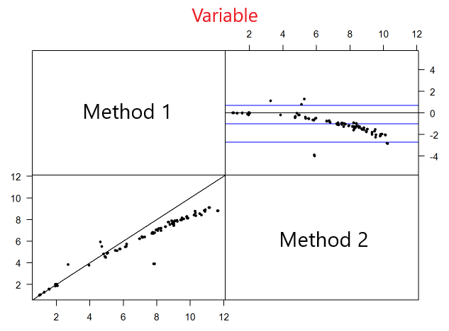

# Method Comparison Study

In this (ongoing) project, I've been asked to analyze a set of data from a clinical veterinary laboratory.

The aim is to understand wether a new diagnostic method (or technology) can be used interchangeably with another one, considered the gold standard.

To do so, I've put the initial data in R and proceeded with the analyses using a specific R package called ["MethComp"](https://cran.r-project.org/web/packages/MethComp/MethComp.pdf).

## MethComp
The package morphs input data into an R-object, used by the same to do different type of plots such as:
* [Identity plot]((Identity and B-A plots)
* [Bland-Altman plot](Identity and B-A plots)

and also different type of regression models (Passing-Bablock or Deming regressions).

## Initial Data
This table simulates the rows and the columns of the initial data that I've used for the analyses.

id | methods | replicate | variable1 | ... | variable x
---|---------|-----------|-----------|-----|------------
1 |  A  | 1| 4.2|...|0.02
1 |  A  |2|4.5|...|0.04
1|B|1|5.1|...|0.5
1|B|2|5|...|0.1
2|...|...|...|...|...
...|...|...|...|...|...
118|B|2|...|...|...

As we can see, there where two observations for each used method.

## Identity and B-A plots
Thanks to the package, some initial (but sometime exhaustive) plot can be drawn:

 The title represents one of the x variables analyzed by the method/technology.
 The upper plot is the Bland-Altman plot, while the lower one is the Identity line plot. 
