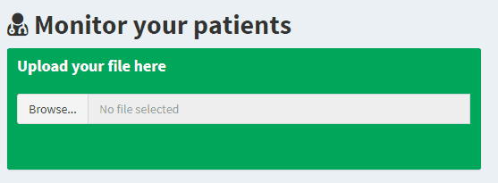

#  [Serena](https://github.com/FrancescoTranquillo/Serena): a Shiny dashboard for monitoring of hypertension

## Contents

* Introduction
* Installation
* Methodology
* Manual
{:toc}

## Introduction
The dashboard is designed to host "Employee Data" (ED) and "Specialized Practitioner Data" (SPD). ED and SPD are managed by 2 different parts of the app in order to visualize different types of information. You can visualize a full detailed pdf report [here](report.pdf)

## Installation

Run the app from **R** or **R Studio** using the following code:

` rungGitHub("Serena","FrancescoTranquillo")`

Note that you will also need to install various libraries in order to make the app run.
Currently, Serena is using these libraries:
1. shiny
2. shinydashboard
3.  DT
4.  ggplot2
5.  plotly
6. reshape2
7. data.table

To install them copy and paste this code on R:

`install.packages(c("shiny",
"shinydashboard",
"DT",
"ggplot2",
"plotly",
"reshape2",
"data.table"))`

To run the app from your browser you can also go to this [link](https://FrancescoTranquillo.shinyapps.io/Medinfo/)

## Methodology

Serena has been developed using many different packages of the software R. These packages are used within the app during the data preparation for the plotting of the temporal trends.

The plots are obtained using mainly "ggplot2" package. The interactivity is given by "plotly" which is a JavaScript package that makes easier for the user to visualize and interact with the plot.
***

## Manual

### 1 Upload your data

To upload your data, simply locate the file through the "browse" button and select it:

You can also upload your data simply using the **"Drag&Drop"** feature.

### 2 Visualize your data

Once your data will be uploaded, you will able to visualize multiple interactive plots:

You will notice that hovering the plot with your pointer will enable an informative box.

### 3 That's all!
That's all you need to interact with your data using Serena.
