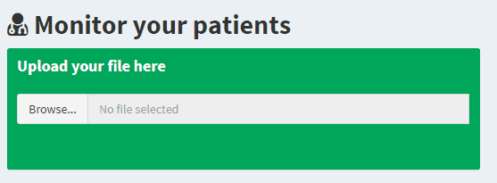

# 1 Upload your data

To upload your data, simply locate the file through the "browse" button and select it:

You can also upload your data simply using the **"Drag&Drop"** feature.

# 2 Visualize your data

Once your data will be uploaded, you will able to visualize multiple interactive plots:

You will notice that hovering the plot with your pointer will enable an informative box.

# 3 That's all!
That's all you need to interact with your data using Serena.
