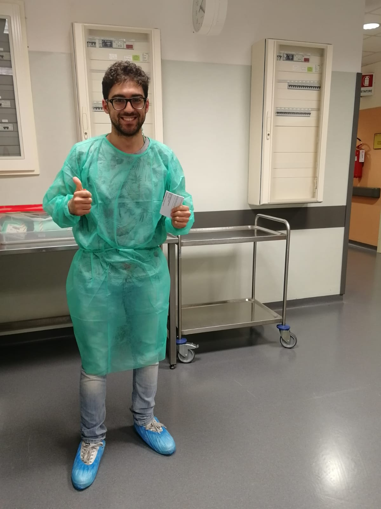

# Welcome
{:data-width="1440" data-height="836"}
{:.figure}

First post using Jekyll!

Today I've finally got the opportunity to extract the backup files of the endoscope washing machines I'm working on for the [INSIGHT](../Projects/INSIGHT/readme.md) project.

The extraction took about 20 minutes in total and everything proceeeded well. It was quite funny to see the operator's faces while I was working on their machines, as they were trying to understand who the heck was I and what I was doing to their precious devices.
