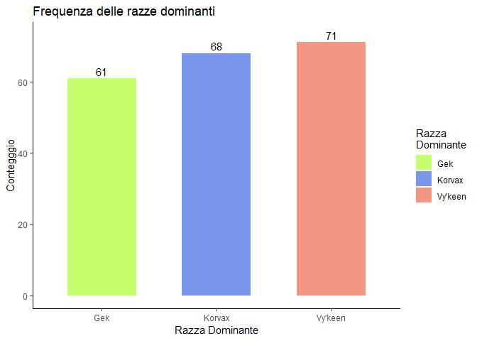
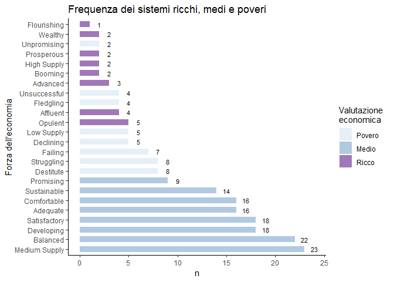
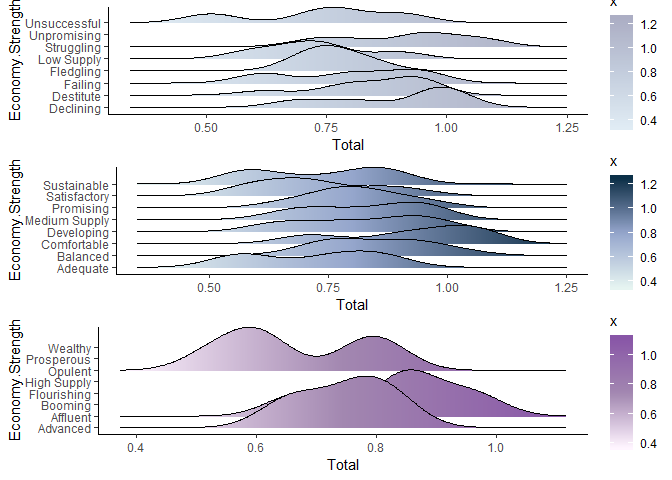
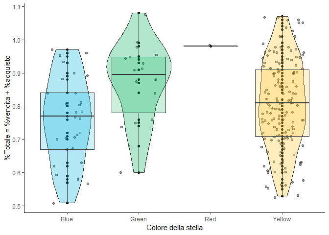

Frequenza delle razze: C'è una razza più frequente nell'universo?
=================================================================

Non sembra esserci una razza dominante.

C'è una razza più "ricca"?
==========================

Si sa, i Vy'keen sono onorevoli guerrieri, i Korvax sono dediti alla scienza e alla loro "Convergenza", mentre i Gek sono abili commercianti. Analizziamo quindi i dati commerciali dei loro sistemi per scoprire se effettivamente i Gek sono abili nel commercio.

Nel grafico i Gek hanno una più alta densità di sistemi con una percentuale commerciale totale pari al 90%. Inoltre si può notare come le loro percentuali si concentrino intorno all'85% circa, seguiti da Korvax (81%) e Vy'keen (78%).

Nonostante i pochi dati a disposizione, i Gek sembrano davvero essere meritevoli del primato economico!

Distribuzione della ricchezza galattica
=======================================

Come è distribuita la ricchezza nella galassia?

I sistemi "medi" sono molto più frequenti di quelli poveri, che sono a loro volta più frequenti di quelli ricchi. Tutto sommato, la galassia di Euclide non è un brutto posto per i commercianti.

Forza economica VS Ricchezza: i sistemi più ricchi, hanno davvero percentuali commercialipiù alte?
==================================================================================================

Verrebbe da pensare che i sistemi "Ricchi" siano appunto tali da essere caratterizzati da indici economici migliori rispetto agli altri sistemi. Verifichiamolo!

sembra di sì, dal grafico di densità di Ridge, si può dedurre che i sistemi ricchi presentano una più alta densità di valori percentuali tra l'80% e il 90%.

Che colore hanno i sistemi con le percentuali commerciali più alte?
===================================================================

Avendo a disposizione i dati, possiamo indagare la relazione tra:

-   La statistica "Totale": somma delle percentuali di vendita e di acqusito di un sistema
-   Il colore del sistema stellare
    

    
    

    Dal grafico si può dedurre che:

-   <b>Sistemi gialli</b>: caratterizzati da percentuali commerciali totali distribuite in modo omogeneo con una dispersione maggiore rispetto agli altri sistemi nel range 55% - 105%. Questo può essere dovuto al fatto che, numericamente parlando, sono i sistemi più comuni

-   <b>Sistemi Verdi</b>: hanno percentuali mediamente più alte in un range più stretto rispetto a quelli gialli. Inoltre presentano una densità maggiore di percentuali intorno all'85% rispetto a tutti gli altri sistemi. In futuri studi sarebbe da indagare la possibilità che questi sistemi siano "migliori" per il commercio.

-   <b>Sistemi Blu </b>: similmente rispetto ai sistemi verdi, sono caratterizzati da percentuali distribuite su un range più ristretto, tuttavia le percentuali estreme osservate risultano minori di quelle dei sistemi verdi.

-   <b>Sistemi Rossi </b>: interessante notare che, nei dati, è presente un solo salto (su 200) effettuato in un sistema rosso non disabitato. Interessante anche notare l'alta percentuale presente in quel sistema
